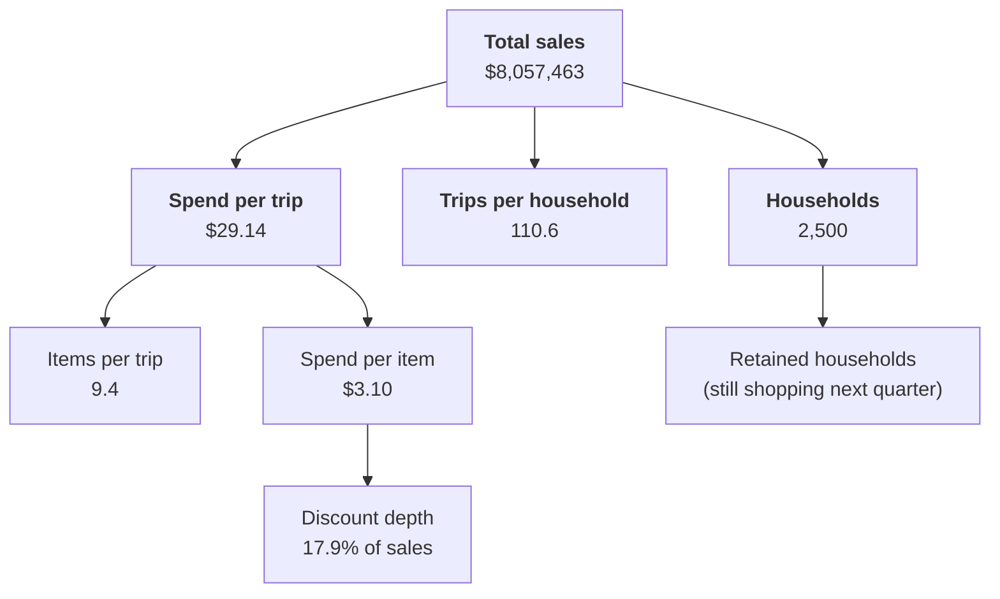
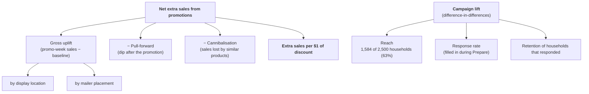

# KPI tree

Every number in this project rolls up to one of two trees. The **sales tree** shows where sales come from. The **promotion tree** shows whether promotions actually created any of them.

Numbers are two-year totals from the raw data (see `notebooks/00_quick_look.ipynb`). They get rechecked after cleaning.

## Sales tree

**Check:** 2,500 × 110.6 × $29.14 = **$8.06M**. Because the tree multiplies out exactly, any change in sales can be split into more customers, more visits or bigger baskets.

## Promotion tree

## How each KPI is calculated

| KPI | Formula | Where it comes from |
|---|---|---|
| Total sales | sum of `sales_value` | transaction_data |
| Households | count of distinct `household_key` | transaction_data |
| Trips | count of distinct `basket_id` | transaction_data |
| Trips per household | trips ÷ households | transaction_data |
| Spend per trip | sales ÷ trips | transaction_data |
| Items per trip | purchase lines ÷ trips | transaction_data |
| Discount depth | (retail + coupon discounts) ÷ sales | transaction_data |
| Rolling 4-week sales | sum of the last 4 weeks | weekly sales view |
| Week-on-week change | (this week − last week) ÷ last week | weekly sales view |
| **Baseline** | what a product normally sells in a week with no promotion, adjusted for season and price | transaction_data + causal_data |
| **Uplift %** | (promo-week sales − baseline) ÷ baseline | as above |
| **Extra sales $** | promo-week sales − baseline | as above |
| **Pull-forward** | how far sales fall below baseline in the 1–2 weeks after a promotion | as above |
| **Cannibalisation** | drop in sales of similar products (same `sub_commodity_desc`) during the promo week | + product |
| Net extra sales | extra sales − pull-forward − cannibalisation | as above |
| Campaign reach | households targeted ÷ all households | campaign_table |
| Response rate | targeted households with at least one redemption ÷ targeted households | campaign_table, coupon_redempt |
| **Campaign lift** | (targeted: during − before) − (comparison group: during − before), weekly spend | transaction_data, campaign_table, campaign_desc |
| Retention rate | households active in a quarter and the next ÷ households active in that quarter | transaction_data |
| Churn-risk flag | no trip in the last N weeks (N set from the data) | transaction_data |
| RFM score | recency, frequency and money scores, 1–5 each | transaction_data |

## Plain-English glossary

- **Baseline:** what a product would have sold in a normal week with no promotion. Every uplift number is measured against it.
- **Uplift / extra sales:** sales above the baseline, i.e. the sales the promotion actually caused.
- **Pull-forward:** customers stock up during the promotion and buy less afterwards, so some of the "extra" sales were just borrowed from later weeks.
- **Cannibalisation:** the promoted product takes sales from a similar product (one cereal brand from another), so the category as a whole doesn't grow.
- **Difference-in-differences:** compares how spending changed for households that got a campaign with how it changed for similar households that didn't. Subtracting the second change removes things that hit everyone, like seasons.
- **RFM:** scores each customer on how **R**ecently they shopped, how **F**requently, and how much **M**oney they spent, then groups similar customers together.

## Data notes to carry into Prepare and Process

- Discounts are stored as negative numbers, but `retail_disc` has a few positive values (max +3.99). Check these during cleaning.
- No real dates: only `day` (1–711) and `week_no` (1–102).
- Column names mix upper and lower case across files; I lowercase them on load.
- `causal_data.csv` (displays and mailers) is about 700 MB, so it gets loaded straight into PostgreSQL rather than opened in Excel.
